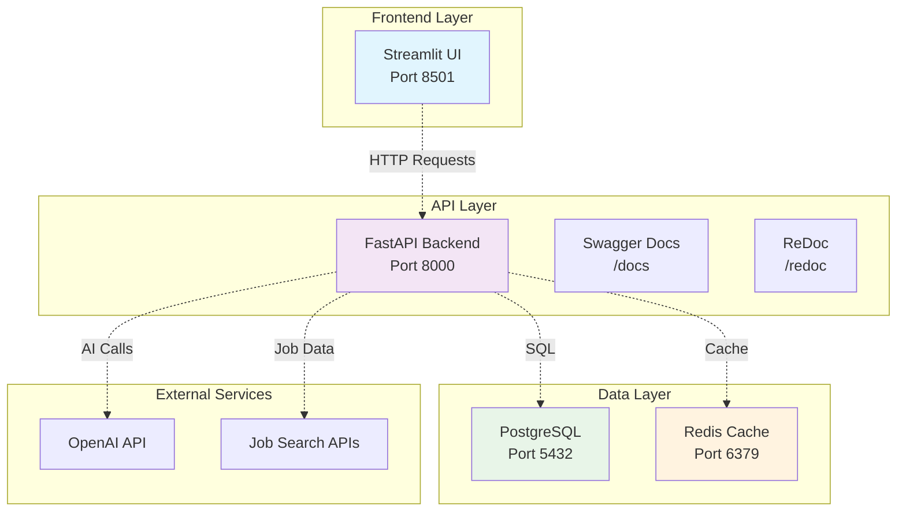
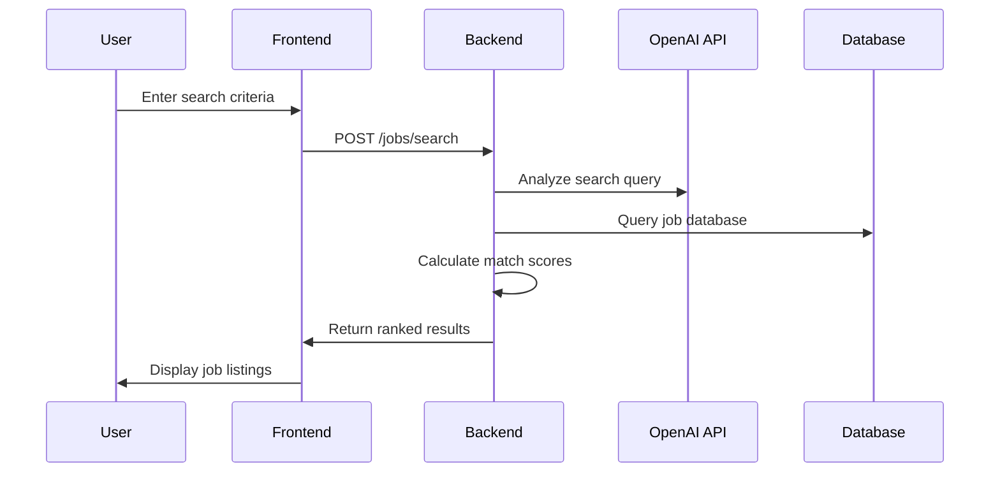
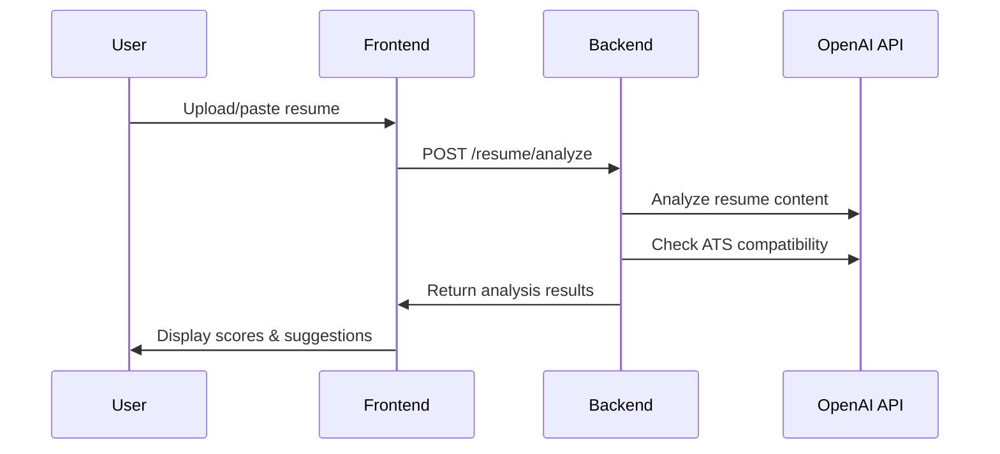

# GPT-JobHunter Architecture

## 🏗️ Decoupled Architecture Overview

The GPT-JobHunter application has been designed with a **fully decoupled architecture** that separates the backend API from the frontend UI, providing better scalability, maintainability, and deployment flexibility.

## 🔄 Application Flow



## 📡 API Communication

### Frontend → Backend Communication

The Streamlit frontend communicates with the FastAPI backend through HTTP requests:

```python
# Example API call from frontend
response = requests.post(
    f"{API_BASE_URL}/jobs/search",
    json=search_params,
    headers={"Authorization": f"Bearer {token}"}
)
```

### Key API Endpoints

| Category | Endpoint | Method | Description |
|----------|----------|--------|-------------|
| **Auth** | `/auth/register` | POST | User registration |
| **Auth** | `/auth/login` | POST | User authentication |
| **Profile** | `/profile` | GET/POST/PUT | Profile management |
| **Jobs** | `/jobs/search` | POST | AI-powered job search |
| **Jobs** | `/jobs/recommendations` | GET | Personalized recommendations |
| **Resume** | `/resume/analyze` | POST | Resume analysis |
| **Resume** | `/resume/optimize` | POST | Resume optimization |
| **Cover Letter** | `/cover-letter/generate` | POST | Cover letter generation |
| **Interview** | `/interview/prepare` | POST | Interview preparation |
| **Analytics** | `/analytics/job-market` | GET | Market analysis |
| **Analytics** | `/analytics/career-advice` | POST | Career guidance |

## 🔧 Component Details

### 1. FastAPI Backend (`/backend`)

**Purpose**: Provides RESTful API endpoints for all job hunting functionality

**Key Features**:
- JWT Authentication
- Comprehensive API documentation (Swagger/ReDoc)
- AI-powered job matching
- Resume analysis and optimization
- Cover letter generation
- Interview preparation
- Career analytics

**Technology Stack**:
- FastAPI for API framework
- Pydantic for data validation
- SQLAlchemy for database ORM
- OpenAI for AI capabilities
- Redis for caching

### 2. Streamlit Frontend (`/frontend`)

**Purpose**: Provides user-friendly web interface

**Key Features**:
- Interactive dashboard
- Multi-page navigation
- Real-time API communication
- File upload capabilities
- Data visualization with Plotly
- Responsive design

**Technology Stack**:
- Streamlit for web framework
- Requests for API communication
- Pandas for data handling
- Plotly for visualizations

### 3. Database Layer

**PostgreSQL Database**:
- User management
- Job data storage
- Application tracking
- Profile information

**Redis Cache**:
- Session management
- API response caching
- Background task queue

## 🚀 Deployment Architecture

### Docker Compose Setup

```yaml
services:
  frontend:    # Streamlit UI (Port 8501)
  backend:     # FastAPI (Port 8000)
  db:          # PostgreSQL (Port 5432)
  redis:       # Redis Cache (Port 6379)
  nginx:       # Reverse Proxy (Port 80)
```

### Environment Configuration

```bash
# Backend Configuration
DATABASE_URL=postgresql+asyncpg://...
REDIS_URL=redis://localhost:6379/0
OPENAI_API_KEY=your-key-here

# Frontend Configuration
API_BASE_URL=http://backend:8000

# Security
SECRET_KEY=your-secret-key
CORS_ORIGINS=http://localhost:8501
```

## 🔒 Security Architecture

### Authentication Flow

1. **User Registration/Login**
   - User submits credentials via Streamlit form
   - Frontend sends POST request to `/auth/login`
   - Backend validates credentials and returns JWT token
   - Frontend stores token in session state

2. **Authenticated Requests**
   - Frontend includes JWT token in Authorization header
   - Backend validates token on each request
   - User context maintained throughout session

### CORS Configuration

```python
app.add_middleware(
    CORSMiddleware,
    allow_origins=["http://localhost:8501"],
    allow_credentials=True,
    allow_methods=["GET", "POST", "PUT", "DELETE"],
    allow_headers=["*"],
)
```

## 📊 Data Flow Examples

### 1. Job Search Flow



### 2. Resume Analysis Flow



## 🔄 Scalability Considerations

### Horizontal Scaling

- **Frontend**: Multiple Streamlit instances behind load balancer
- **Backend**: Multiple FastAPI instances with shared database
- **Database**: PostgreSQL read replicas for improved performance
- **Cache**: Redis cluster for distributed caching

### Performance Optimization

- **API Response Caching**: Redis caching for frequently accessed data
- **Database Indexing**: Optimized queries for job search and user data
- **Async Processing**: FastAPI's async capabilities for I/O operations
- **Connection Pooling**: Efficient database connection management

## 🛠️ Development Workflow

### Local Development

1. **Backend Development**:
   ```bash
   cd backend
   source venv/bin/activate
   uvicorn app.main:app --reload
   ```

2. **Frontend Development**:
   ```bash
   cd frontend
   source venv/bin/activate
   streamlit run app.py
   ```

### API Testing

- **Interactive Docs**: http://localhost:8000/docs
- **ReDoc**: http://localhost:8000/redoc
- **Manual Testing**: Use curl or Postman
- **Automated Testing**: pytest test suite

## 📈 Monitoring & Observability

### Health Checks

- **Backend**: `/health` endpoint for service status
- **Frontend**: Streamlit built-in health endpoint
- **Database**: Connection health monitoring
- **Docker**: Container health checks

### Logging

```python
# Backend logging
import logging
logger = logging.getLogger(__name__)
logger.info("API request processed")

# Frontend logging
import streamlit as st
st.error("API connection failed")
```

## 🔮 Future Enhancements

### Microservices Evolution

The current architecture can be further decomposed into microservices:

- **User Service**: Authentication and profile management
- **Job Service**: Job search and recommendations
- **AI Service**: Resume analysis and optimization
- **Notification Service**: Email and push notifications
- **Analytics Service**: Career insights and reporting

### API Gateway

Consider adding an API Gateway for:
- Request routing
- Rate limiting
- Authentication centralization
- Request/response transformation
- Monitoring and analytics

This decoupled architecture provides a solid foundation for scaling the GPT-JobHunter application while maintaining clean separation of concerns and enabling independent development and deployment of frontend and backend components.