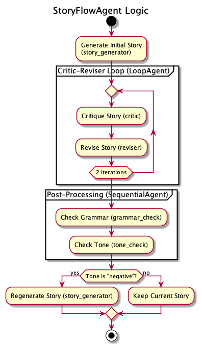

# AI Agents Showcase (ADK Examples)

This repository contains a collection of example AI agents built using the Google Agent Development Kit (ADK). These examples demonstrate various capabilities of ADK, from simple single-agent setups to multi-agent systems and integration with external tools via Model Context Protocol (MCP).

## Agents Overview

Below is a summary of the agents available in this repository:

*   **`mcp_agent_google_maps`**:
    *   **Name**: `maps_assistant_agent`
    *   **Functionality**: An LLM agent that utilizes Google Maps tools (via MCP) to assist with mapping, directions, and finding places.
    *   **Models Used**: `gemini-1.5-flash-latest`
    *   **Dependencies**: Requires a `GOOGLE_MAPS_API_KEY` environment variable.

*   **`mcp_agent_filesystem`**:
    *   **Name**: `filesystem_assistant_agent`
    *   **Functionality**: An LLM agent that interacts with the local filesystem (via MCP) to perform actions like listing directories and reading files.
    *   **Models Used**: `gemini-2.5-flash-preview-05-20`
    *   **Dependencies**: Requires a `TARGET_FOLDER_PATH` variable in `agent.py` to be set to an **absolute path** accessible by the agent. *Consider making this configurable via an environment variable for better security and flexibility.*

*   **`weather_multi_agents_w_state`**:
    *   **Root Agent Name**: `weather_agent_v4_stateful`
    *   **Functionality**: A multi-agent system for weather information. The root agent (`weather_agent_v4_stateful`) handles weather queries using a stateful tool (`get_weather_stateful`) that remembers the user's preferred temperature unit (Celsius/Fahrenheit) from session state. It delegates greetings and farewells to specialized sub-agents.
    *   **Sub-Agents**: `greeting_agent`, `farewell_agent`
    *   **Models Used**: `gemini-2.5-flash-preview-05-20` (for all agents)
    *   **Tools**: `get_weather_stateful` (mock data), `say_hello`, `say_goodbye`
    *   **Features**: Demonstrates multi-agent delegation, session state management, and auto-saving agent output to state.

*   **`weather_multi_agents`**:
    *   **Root Agent Name**: `weather_agent_v2`
    *   **Functionality**: A simpler multi-agent system for weather information. The root agent (`weather_agent_v2`) handles weather queries using a stateless `get_weather` tool (mock data, Celsius only) and delegates greetings/farewells.
    *   **Sub-Agents**: `greeting_agent`, `farewell_agent`
    *   **Models Used**: `gemini-2.5-flash-preview-05-20` (for all agents)
    *   **Tools**: `get_weather` (mock data), `say_hello`, `say_goodbye`
    *   **Features**: Demonstrates basic multi-agent delegation.

*   **`weather_agent_openai`**:
    *   **Name**: `weather_agent_gpt`
    *   **Functionality**: A single agent that provides weather reports using OpenAI's `gpt-4.1` model (via LiteLLM integration) and a mock `get_weather` tool.
    *   **Models Used**: `openai/gpt-4.1`
    *   **Dependencies**: Requires an OpenAI API key (implicitly, via LiteLLM configuration).
    *   **Tools**: `get_weather` (mock data)

*   **`weather_agent_anthropic`**:
    *   **Name**: `weather_agent_gpt` (Note: Consider renaming to `weather_agent_claude` for clarity)
    *   **Functionality**: A single agent that provides weather reports using Anthropic's `claude-opus-4-20250514` model (via LiteLLM integration) and a mock `get_weather` tool.
    *   **Models Used**: `anthropic/claude-opus-4-20250514`
    *   **Dependencies**: Requires an Anthropic API key (implicitly, via LiteLLM configuration).
    *   **Tools**: `get_weather` (mock data)
    *   **Note**: The agent's name and description in `agent.py` seem to be copied from the OpenAI example and should be updated to reflect the Anthropic model.

*   **`weather_agent_gemini`**:
    *   **Name**: `weather_agent_v1_gemini`
    *   **Functionality**: A single agent that provides weather reports using Google's `gemini-2.5-flash-preview-05-20` model and a mock `get_weather` tool.
    *   **Models Used**: `gemini-2.5-flash-preview-05-20`
    *   **Dependencies**: Requires a Google API key (implicitly, for Gemini models).
    *   **Tools**: `get_weather` (mock data)

*   **`loop_agent_writer_critic`**:
    *   **Root Agent Name**: `IterativeWritingPipeline`
    *   **Functionality**: A sequential agent that demonstrates an iterative writer-critic loop. It starts with an initial topic from the user, writes a short draft, and then repeatedly critiques and refines the draft until the critic agent decides it's complete.
    *   **Sub-Agents**: `InputMapper`, `InitialWriterAgent`, `RefinementLoop` (which contains `CriticAgent` and `RefinerAgent`).
    *   **Models Used**: `gemini-2.0-flash`
    *   **Tools**: A custom `exit_loop` tool is used to programmatically stop the refinement cycle.
    *   **Features**: Demonstrates a `SequentialAgent` pipeline, a `LoopAgent` for iterative tasks, complex state management between agents, and using a custom tool to control workflow logic.
    *   **How to Run**:
        *   **Interactive CLI**: Run `adk run loop_agent_writer_critic`. When the prompt `>` appears, enter a topic for the story (e.g., "a story about a lost robot").
        *   **Web UI**: Launch `adk web` and select `loop_agent_writer_critic.agent` from the list.

## Custom Workflow Agent

The `custom_workflow_agent` is a sophisticated agent designed to demonstrate complex workflow orchestration using the Agent Development Kit (ADK). It follows a multi-step process to generate, critique, revise, and refine a story based on a given topic.

### Architecture

The agent's logic is composed of several specialized sub-agents that are orchestrated by a central `StoryFlowAgent`. The workflow includes loops, sequential execution, and conditional logic, as illustrated in the diagram below:



### How to Run

You can run this agent from the command line in either interactive mode or via the web interface.

**Interactive CLI:**

```bash
adk run custom_workflow_agent
```

**Web Interface:**

```bash
adk web custom_workflow_agent
```

## Google Agent Development Kit (ADK)

The Agent Development Kit (ADK) is a flexible and modular framework by Google for developing and deploying AI agents. It is model-agnostic, deployment-agnostic, and designed for compatibility with other frameworks, making it easier to create, deploy, and orchestrate agentic architectures.

### Key Features of ADK:
*   **Flexible Orchestration**: Define workflows using workflow agents or LLM-driven dynamic routing.
*   **Multi-Agent Architecture**: Compose multiple specialized agents in a hierarchy.
*   **Rich Tool Ecosystem**: Utilize pre-built tools, create custom functions, integrate 3rd-party libraries, or use MCP tools.
*   **Deployment Ready**: Containerize and deploy agents locally, on Cloud Run, GKE, or Vertex AI Agent Engine.
*   **Built-in Evaluation**: Assess agent performance systematically.
*   **Streaming Capabilities**: Support for bidirectional audio and video streaming for natural interactions.

### Installation

1.  **Set up a Python Environment**:
    It's highly recommended to use a virtual environment.
    ```bash
    python -m venv .venv
    # Activate on macOS/Linux
    source .venv/bin/activate
    # Activate on Windows CMD
    # .venv\Scripts\activate.bat
    # Activate on Windows PowerShell
    # .venv\Scripts\Activate.ps1
    ```

2.  **Install ADK**:
    ```bash
    pip install google-adk
    ```

3.  **Install Project Dependencies**:
    This project uses Poetry for dependency management.
    ```bash
    pip install poetry
    poetry install
    ```

### Configuration

Copy the `.env-example` file to a new file named `.env` in the project root:
```bash
cp .env-example .env
```
Then, edit the `.env` file to add your actual API keys and other necessary configurations. The `.env` file is already included in `.gitignore` and should not be committed to version control.

1.  **API Keys (edit your `.env` file)**:
    *   **Google Gemini Models**: If you are using Gemini models directly (e.g., `weather_agent_gemini`), set `GOOGLE_API_KEY`.
    *   **OpenAI Models**: If using agents like `weather_agent_openai`, set `OPENAI_API_KEY`. LiteLLM, used by ADK for these models, will typically pick this up.
    *   **Anthropic Models**: If using agents like `weather_agent_anthropic`, set `ANTHROPIC_API_KEY`. LiteLLM will use this.
    *   **Google Maps MCP Agent**: The `mcp_agent_google_maps` requires `GOOGLE_MAPS_API_KEY`. This key is passed to the MCP server process.

    See `.env-example` for the exact variable names.

2.  **Vertex AI Configuration (Optional, in your `.env` file)**:
    If you prefer to use Google Cloud Vertex AI as the backend for Gemini models (instead of using `GOOGLE_API_KEY` directly), you can configure this in your `.env` file by setting:
    *   `GOOGLE_CLOUD_PROJECT="your-gcp-project-id"`
    *   `GOOGLE_CLOUD_LOCATION="your-gcp-region"` (e.g., `us-central1`)
    *   `GOOGLE_GENAI_USE_VERTEXAI="True"`
    If you use this method, ensure you have:
        *   Set up a Google Cloud Project and enabled the Vertex AI API.
        *   Installed and initialized the Google Cloud CLI (`gcloud init`).
        *   Logged in for Application Default Credentials (`gcloud auth application-default login`).
    If `GOOGLE_GENAI_USE_VERTEXAI` is not set or is `False`, ADK will typically look for `GOOGLE_API_KEY` for Gemini models.

3.  **Filesystem MCP Agent Configuration**:
    For the `mcp_agent_filesystem`, you **must** edit `mcp_agent_filesystem/agent.py` and change the `TARGET_FOLDER_PATH` to an **absolute path** on your system that the agent should have access to. For example:
    ```python
    # In mcp_agent_filesystem/agent.py
    TARGET_FOLDER_PATH = "/Users/yourusername/Documents/shared_with_agent"
    ```
    **Security Note**: Be very careful about which folders you grant access to. It's recommended to create a specific, isolated folder for the agent to interact with.

### Running Agents with ADK Web UI

ADK provides a web UI for interacting with your agents locally.

1.  **Navigate to the project root directory** (the one containing `pyproject.toml` and the agent subfolders).

2.  **Set necessary environment variables** as described in the "Configuration" section. For example, if you want to run the `mcp_agent_google_maps`:
    ```bash
    export GOOGLE_MAPS_API_KEY="YOUR_GOOGLE_MAPS_API_KEY"
    ```

3.  **Launch the ADK Web UI**:
    ```bash
    adk web
    ```
    This command will scan the current directory and its subdirectories for ADK agents. It typically starts a server at `http://localhost:8000` or `http://127.0.0.1:8000`.

4.  **Open the URL** in your browser. You should see a list of discovered agents.

5.  **Select an agent** from the list (e.g., `mcp_agent_google_maps.agent`) to interact with it.

    *   **For MCP Agents (`mcp_agent_google_maps`, `mcp_agent_filesystem`)**:
        The ADK will automatically start the required `npx` MCP server process in the background when you interact with an agent that uses an MCP toolset. Ensure you have `npx` (usually comes with Node.js) installed and available in your system's PATH. The first time an MCP server is run, `npx` might take some time to download the server package.

### How Agents are Discovered by `adk web`

The `adk web` command looks for Python files named `agent.py` or modules that define a `root_agent` variable. It typically discovers agents based on the folder structure. Each subfolder containing an `agent.py` (or a Python module structure resolving to an agent) will usually be listed.

For example, if you have:
```
your_project_root/
├── mcp_agent_google_maps/
│   ├── __init__.py
│   └── agent.py  # Defines root_agent for maps
├── weather_agent_gemini/
│   ├── __init__.py
│   └── weather_agent_gemini.py # Defines root_agent for gemini weather
└── pyproject.toml
```
When you run `adk web` from `your_project_root/`, it should discover agents like:
*   `mcp_agent_google_maps.agent`
*   `weather_agent_gemini.weather_agent_gemini` (or similar, depending on how `__init__.py` exposes it)


### Deployment

ADK agents can be deployed to various targets:
*   **Locally** (as demonstrated with `adk web` or `adk run <agent_name>`)
*   **Google Cloud Run**
*   **Google Kubernetes Engine (GKE)**
*   **Vertex AI Agent Engine**

For deployment to cloud platforms, ADK can help containerize your agent. Refer to the official ADK documentation for detailed deployment guides.
Example for Cloud Run (from ADK docs):
```bash
# Authenticate with Google Cloud
gcloud auth login

# Deploy with web UI (replace <agent_module_path> e.g., mcp_agent_google_maps.agent)
adk deploy cloud_run --with_ui <agent_module_path>

# Make service public (if needed)
gcloud run services add-iam-policy-binding SERVICE_NAME \
  --region=REGION --member="allUsers" --role="roles/run.invoker"
```

## Further Information

*   **Official ADK Documentation**: [https://google.github.io/adk-docs/](https://google.github.io/adk-docs/)
*   **ADK GitHub Repository**: [https://github.com/google/adk](https://github.com/google/adk) (Note: This link might be for docs, actual code repo might differ or be internal, please verify from official sources)
*   **Vertex AI Agent Engine**: For scalable, managed deployment of agents.

This README provides a starting point. Ensure you consult the official ADK documentation for the most up-to-date and detailed information.


